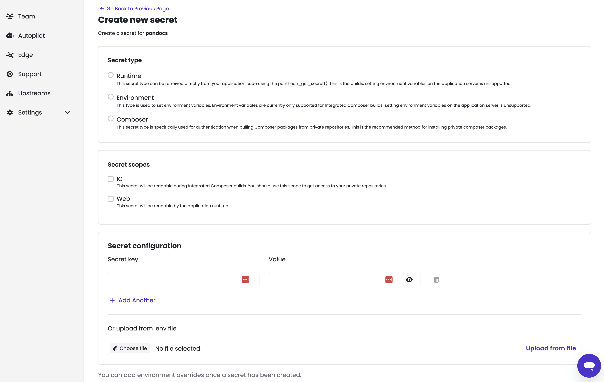

Teams using [Pantheon's Secrets Manager](/guides/secrets) to set variables like API tokens can now do so through the Pantheon dashboard. Previously this feature only had a command line user interface through [a Terminus plugin](https://github.com/pantheon-systems/terminus-secrets-manager-plugin). Secrets Manager works with WordPress, Drupal, and Next.js sites hosted on Pantheon. It does not work with [the sunsetting Front-End Sites product](https://docs.pantheon.io/release-notes/2025/11/nextjs-private-beta).

  

Secrets Managers encrypts values at rest and then makes them available to your application's code as it runs. Secrets Manager is suitable for setting variables that are truly sensitive like a password, token, or key that allows Next.js to read from a back-end CMS as well as variables that might not be sensitive like a Google Tag Manager ID.

Developers managing environment variables for Next.js sites through .env files can add those variables in bulk when creating secrets.

  

Setting organization-wide secrets still requires using [the  Terminus plugin](https://github.com/pantheon-systems/terminus-secrets-manager-plugin). [See this section of documentation for more guidance on using Secrets](https://docs.pantheon.io/guides/secrets).

