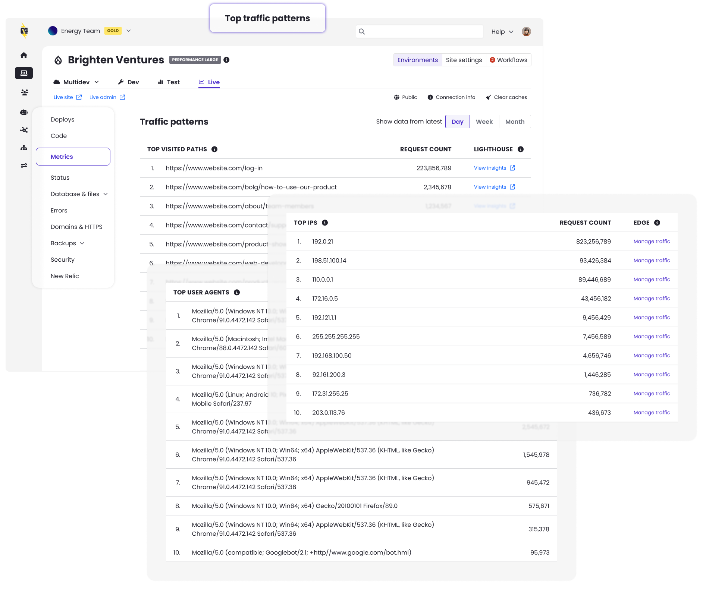

The Metrics page under the Live environment is enhanced to provide visibility into traffic patterns. It now displays lists of:

* Top IPs
* Top user agents
* Top visited URL paths

With this data, you can identify aggressive crawlers or scrapers, that you may want to block manually or prioritize caching and optimization efforts based on the specific pages receiving the highest request volume.

