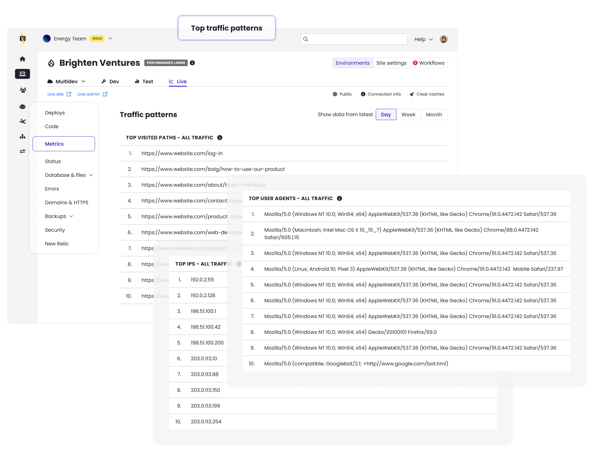

A new user interface is now available in the [Metrics](/guides/account-mgmt/traffic) tab of the Live environment of site dashboards, named **Top traffic patterns** which reports the following new traffic metrics: 

* Top IP addresses
* Top user agents
* Top visited URL paths

With this data, you can identify aggressive crawlers or scrapers, that you may want to block manually or prioritize caching and optimization efforts based on the specific pages receiving the highest request volume.

**Note**: This data includes both [counted](/guides/account-mgmt/traffic#counted-visits) and [uncounted](/guides/account-mgmt/traffic#uncounted-visits) visits.

