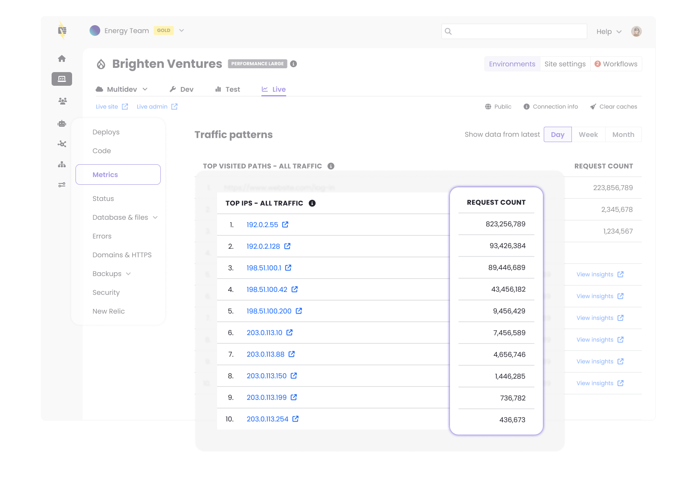

We’ve updated the [Top Traffic Patterns](/guides/account-mgmt/traffic#top-traffic-patterns) interface, located in the Metrics tab of your Live environment dashboard, to give you deeper visibility into your site's traffic. You can now see the exact request count alongside each of the metrics IPs, User Agents, and Paths.

By surfacing the exact volume of requests, it is much easier to measure the true impact of specific actors or pages. These counts help you confidently decide if an aggressive scraper warrants being blocked, or exactly how much load a highly visited path is handling so you can accurately prioritize your caching and optimization efforts.

**Note:** The Top Traffic Patterns feature is in active, iterative development. You can expect frequent updates and new enhancements in the near future.

