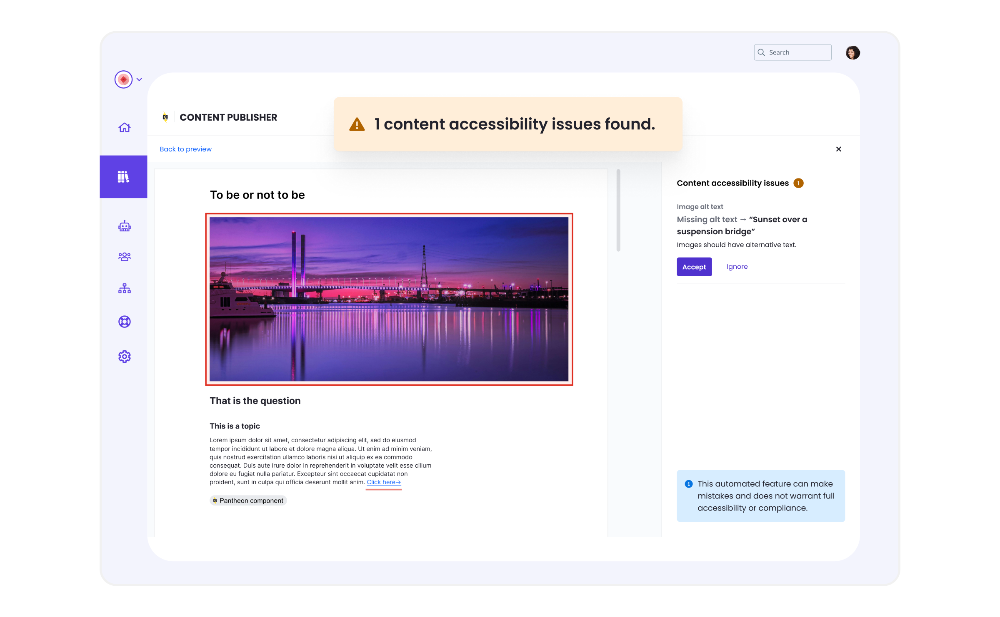

[Content Publisher](https://docs.content.pantheon.io) now includes a quality assistant — an intelligent review system that helps you create better content before you publish. Starting with accessibility checking at no added cost, the quality assistant will expand to help ensure your content meets brand standards, performs well in search, and satisfies compliance requirements.

## What’s new?

The quality assistant's automatic accessibility checking helps catch common issues before you publish:

* Missing alt text on images
* Improper heading hierarchy
* Non-descriptive link text
* and more...

Issues are displayed in the sidebar with plain-language descriptions of the problem, why it affects users with disabilities, how to fix it, and where it occurs in your document.

For more information, see the [quality assistant in the Content Publisher documentation](https://docs.content.pantheon.io/quality-assistant).
