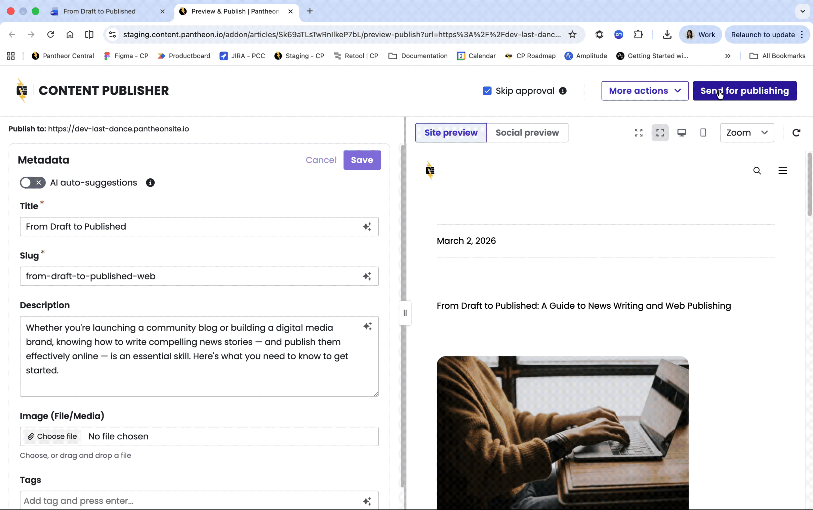

Pantheon Content Publisher now supports Microsoft Word thanks to our new Microsoft Add-in. This add-in allows organizations and teams to publish content directly to their website from their Microsoft 365 account in Microsoft Word. 

## What's new?

* Write, edit, collaborate, and publish from Microsoft Word (online and desktop app) to your website
* Preview how your content will look before it goes live
* Collaborative editing: Use comments, suggestions, and other collaboration features available on Microsoft 365

## Documenttion

Learn how to set up Content Publisher on your Drupal, WordPress, or Next.js website:

* [How to install the Office 365 it](https://docs.content.pantheon.io/msword-add-in-install)
* [Publishing with the Microsoft Word add-in](https://docs.content.pantheon.io/msword-preview-publish)
* [Content Publisher general documentation](http://docs.content.pantheon.io)
