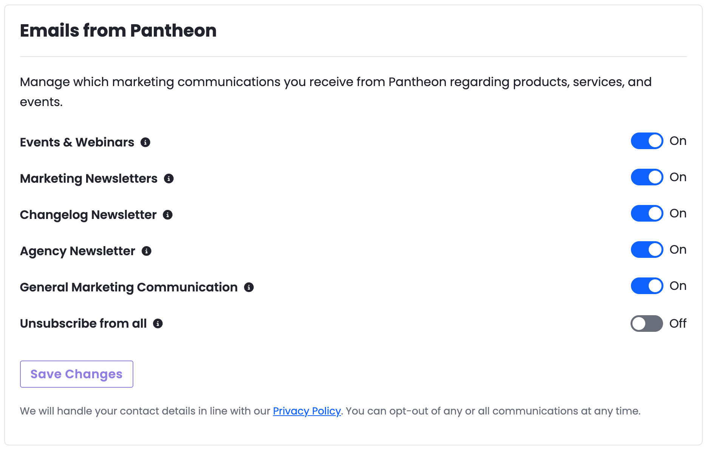

You can now manage your Pantheon marketing email preferences directly from the Pantheon Dashboard. Navigate to **Personal Settings > Email Notifications** to control which communications you receive from Pantheon, including newsletters, events, and product updates.

Changes take effect after clicking **Save Changes**. You can update your preferences at any time.