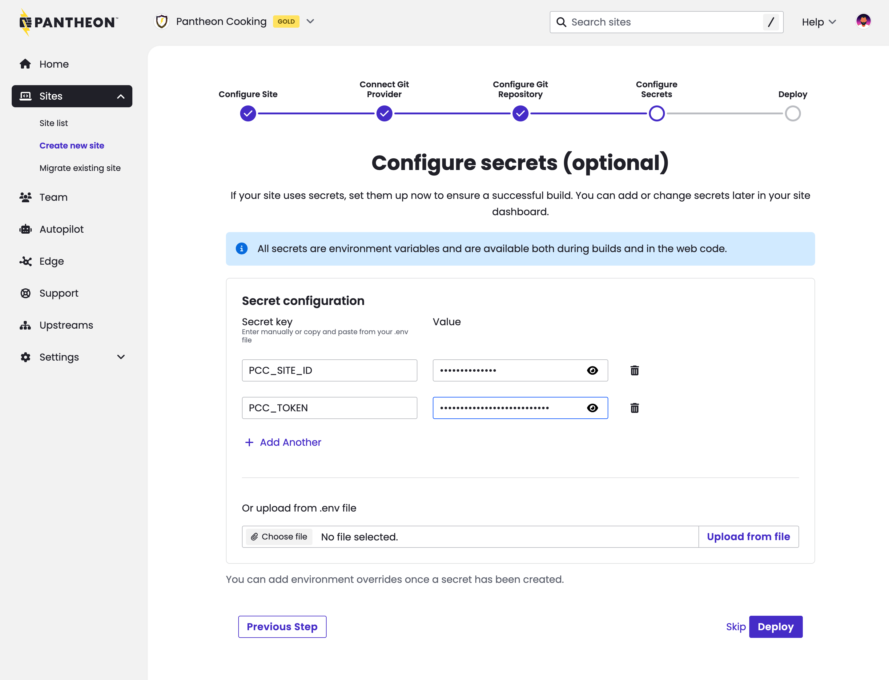

The Next.js site creation process now includes prompts for settings secrets at site creation time. This change benefits sites that need API tokens or other variables in order to build successfully. Prior to this change, developers would newly created site fail its first build before they could set the necessary secrets.

  

Secrets set in this interface are stored securely using Pantheon's [Secrets Manager](/guides/secrets).

The ability to set secrets at site creation time is valuable for anyone standing up our Content Publisher integration. See this [updated tutorial that shows secret-setting at site creation](/nextjs/content-publisher-tutorial).

