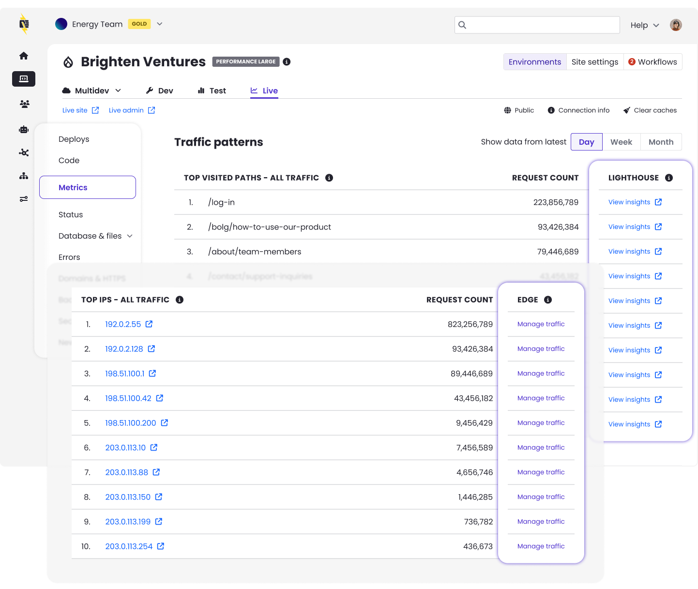

We are continuing to enhance the Top Traffic Patterns interface to help you go from insight to action even faster.

* **Click-to-Audit for top paths:** You can now run Google Lighthouse performance audits directly from the Top Paths table. Easily check the performance and SEO scores of your most visited pages with a single click. (**Note:** To prevent errors, this option is automatically disabled for static assets and backend administrative paths).
* **Streamlined IP Block Requests:** Advanced Global CDN customers can now easily request blocks against bad actors directly from the dashboard. We've added an action link within the Top IPs table that automatically routes the malicious IP details to our support team for blocking, removing the friction of manual context switching.

**Note:** The Top Traffic Patterns feature is in active, iterative development. You can expect frequent updates and new enhancements in the near future.

