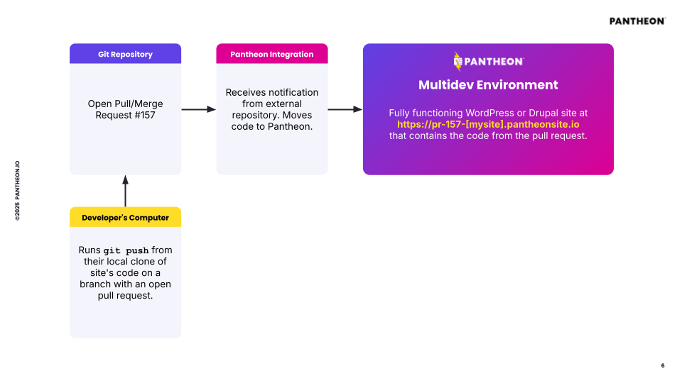

Support for creating Drupal and WordPress sites using an external repository on GitHub is now generally available to Pantheon customers with Gold, Platinum or Diamond Workspaces. Previously, [this capability was restricted to a private beta program](/release-notes/2025/05/github-application); now, it is included as part of the recent [Terminus 4.2.0 Release]().

Sites created on an external GitHub repository utilize a GitHub *Application* that moves code to Pantheon Multidev environments and the Dev environment when correspond to changes are made to on that repository.

This Application is intended for teams that want the simplest possible tool for achieving the above workflow. Once it is turned on, no additional configuration is necessary.

Pantheon continues to offer a [GitHub Action](https://github.com/pantheon-systems/push-to-pantheon) that performs a similar function for teams who want to make customization to their workflows and treat the deployment of code as one step in a larger Continuous Integration workflow.

### **More information**

* [See our documentation page for more instruction on usage and a breakdown of limitations](https://docs.pantheon.io/github-application).
* For support and questions, please file issues on [Terminus issue queue](https://github.com/pantheon-systems/terminus).
* [For general feedback and to express interest in similar integrations with BitBucket, GitLab or other services, please see our roadmap](https://roadmap.pantheon.io/c/115-github-gitlab-and-bitbucket-integration).
