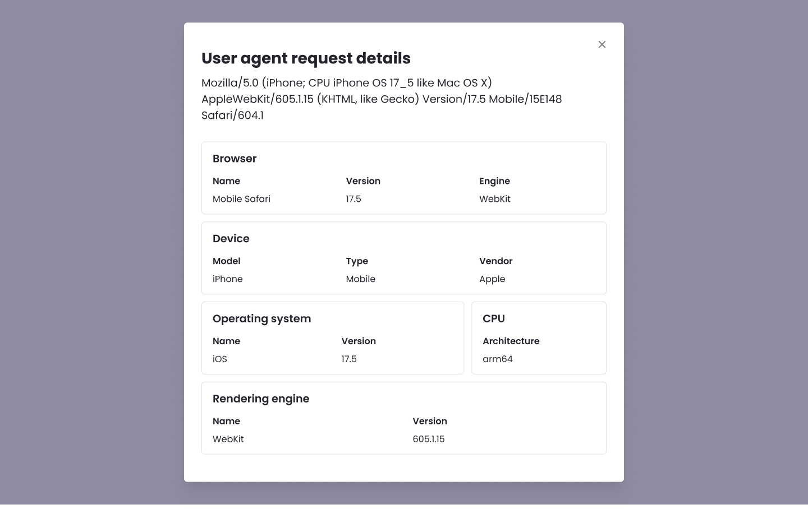

We're introducing a User Agent Parser to the site metrics traffic tables to make traffic analysis faster and more intuitive.

Clicking **View details** next to any user agent now opens a modal that cleanly translates the raw string into readable components, including:

- **Browser** (Name & Version)
- **Operating System** (Name & Version)
- **Device** (Model, Type, & Vendor)
- **CPU Architecture**
- **Rendering Engine**

This update allows you to quickly identify specific traffic sources, browsers, and devices at a glance, while still preserving the exact raw string for your records and security rules.

