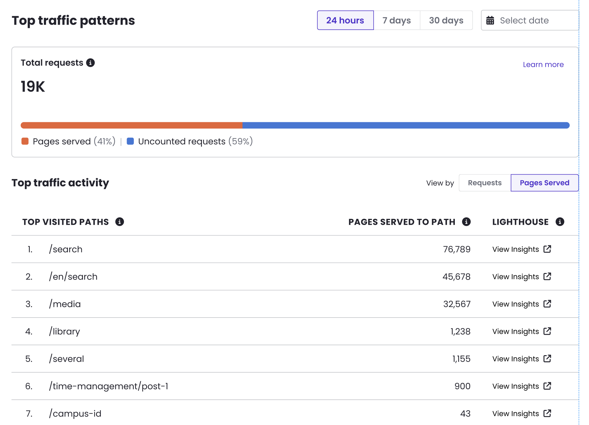

We are continuing to enhance the [Top Traffic Patterns](/guides/account-mgmt/traffic#top-traffic-patterns) interface with clearer visibility into what traffic actually counts toward your bill.

You can now filter the Top Traffic Sources tables – Top Paths, Top IPs, and Top User Agents – to show only Pages Served, the subset of requests that count toward billing. This makes it easy to separate the noise of total traffic from the actual billable traffic driving your usage. A new Total Requests breakdown also shows the split between Pages Served and uncounted requests at a glance.

**Note**: This feature is currently available only for sites migrated to Pantheon's new Global CDN (GCDN). If you don't yet see the toggle on your dashboard, consider migrating to the new GCDN to unlock this and other upcoming traffic insight enhancements.

