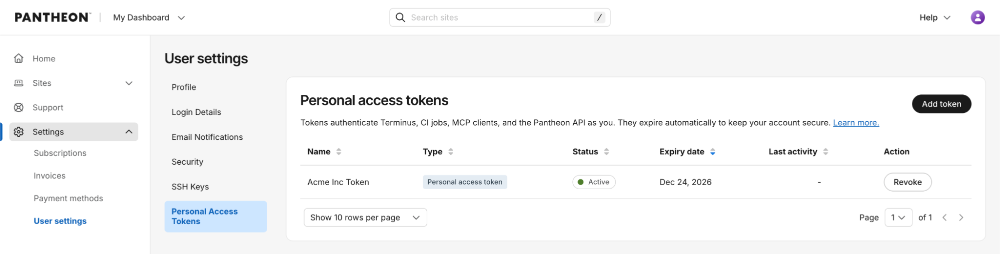

Pantheon is renaming machine tokens to personal access tokens (PATs) and adding stronger security controls with automatic expiration.

## What’s changed
* Time-bound credentials: New PATs expire 90 days after creation, reducing the risk of credentials that remain valid indefinitely.

## What hasn’t changed
* Continue using the same Terminus flow and commands for authentication, listing, and deleting tokens.
* Continue to create and revoke tokens in the dashboard under your User settings. 

## What this means for legacy machine tokens
Existing machine tokens continue to work and are not changed by this release. No immediate action is required. Machine tokens are now considered a legacy authentication method, so we recommend using personal access tokens for new integrations and workflows.

If you adopt a PAT, plan to renew it every 90 days and update the corresponding secret wherever the token is used.

## Get started
Create a new personal access token from **User settings** → **Personal Access Tokens**, copy it once, store it securely, and use it with your existing Terminus authentication workflow.

For more details, [see related documentation](/personal-access-tokens). 
