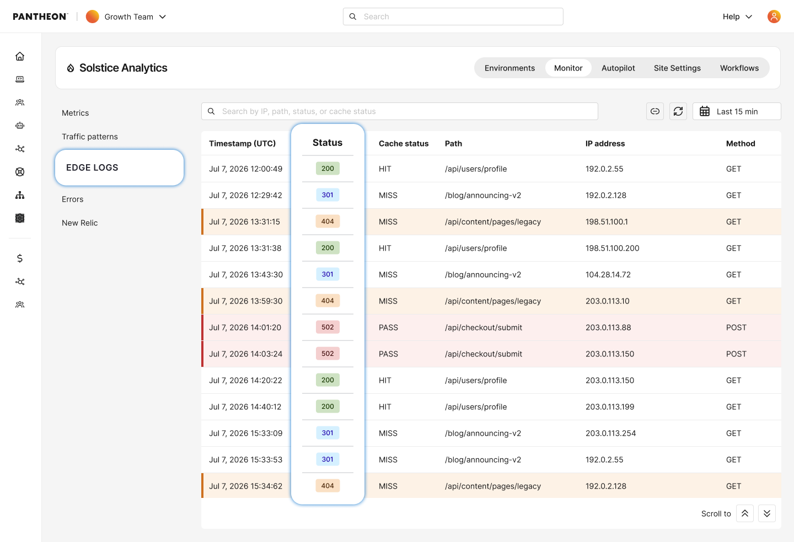

Pantheon now shows edge-level request activity in the dashboard, including cache statuses, ASNs, and response codes.

* A new log explorer in the site dashboard shows how requests were handled at the edge, allowing request-specific investigation for up to 24 hours.
* Search by HTTP status code, path, client IP, user agent, ASN, and time range.
* Copy a permalink to a specific log view, including your search and time range, to share with a teammate for review.

<Alert title="Note" type="info">

This feature requires your site to be on our [next-generation Global CDN](/guides/nextgen-gcdn). If your workspace includes sites still on our legacy Global CDN, your performance overview will only reflect migrated sites.

If you have not started or completed your migration, [visit our documentation](/guides/nextgen-gcdn/setup) to get started.

</Alert>