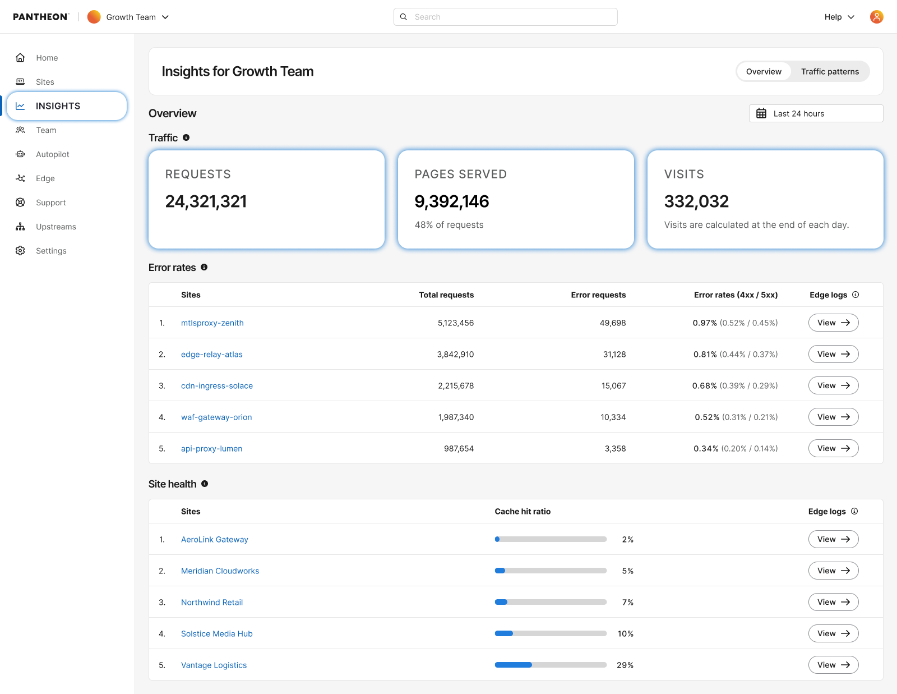

Pantheon has added workspace-level performance visibility to the Workspace dashboard – you can now see which sites in your workspace need attention without checking each site dashboard individually.

* **Error Rates:** A new view on the workspace Insights page ranks your sites by error rate, so you can quickly spot which sites need updates or deeper investigation.
* **Caching Health:** See which sites are seeing degraded cache performance across your entire workspace at a glance.

Click through from a flagged site directly to use deeper troubleshooting tools on its site dashboard.

<Alert title="Note" type="info">

This feature requires your site to be on our [next-generation Global CDN](/guides/nextgen-gcdn). If your workspace includes sites still on our legacy Global CDN, your performance overview will only reflect migrated sites.

If you have not started or completed your migration, [visit our documentation](/guides/nextgen-gcdn/setup) to get started.

</Alert>
