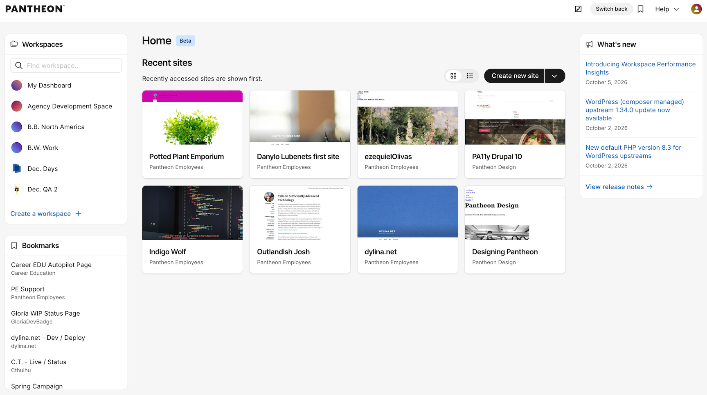
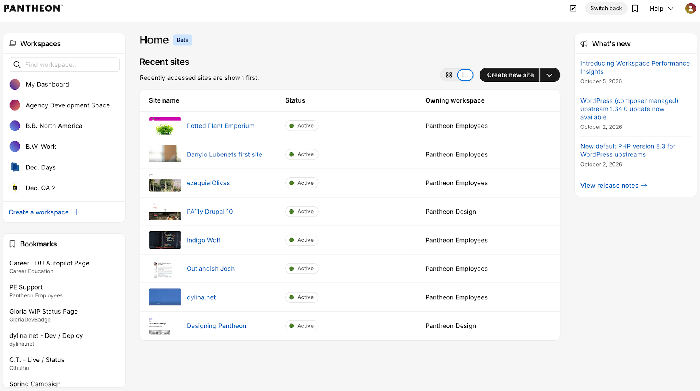
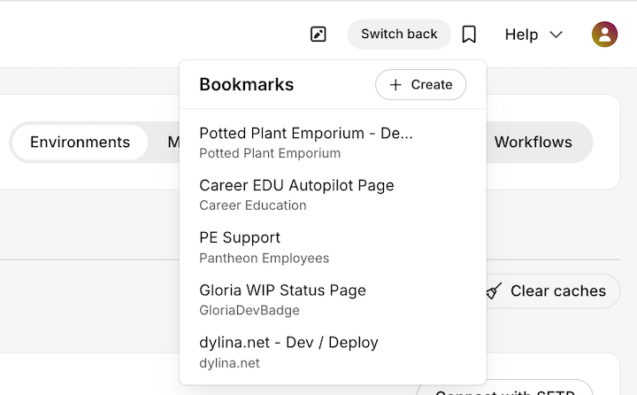

Pantheon’s new dashboard home experience is now available in beta. It gives you a more useful starting point for finding your sites, accessing frequently used pages, and staying up to date with Pantheon.

Recent Sites are available in a card view:

## What’s new

* **A new Home experience** - Get a single view of your Recent Sites across all of your workspaces.
* **Card or list view** - Choose how you want to browse Recent Sites. List view also shows each site’s status and owning workspace.
* **Bookmarks capability** - Create and access bookmarks for your frequently visited pages from Home and dashboard navigation.
* **Release notes in the dashboard** - See the latest Pantheon product updates directly from the Home experience.
* **Refreshed Workspace Overview** - Workspace Overview has a visual refresh and now supports the same card and list views for Recent Sites.

Switch to list view to see site status and owning workspace:

Open the Bookmarks panel to quickly access saved pages:

## How to try it

The new experience is available to all dashboard users, but you’ll continue to land on the current dashboard experience by default. Select **Try the new dashboard** to opt in to the beta. You can select **Switch back** at any time to return to the current experience.
