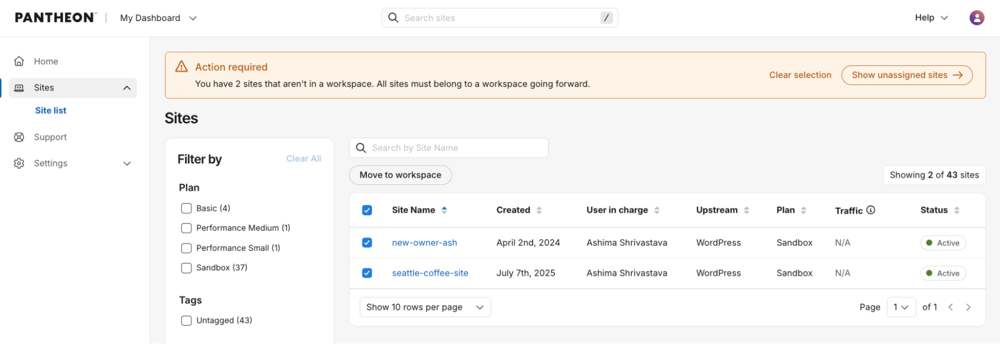

Moving forward, all Pantheon sites must be owned by a Professional Workspace. My Dashboard is not going away, but sites currently owned by an individual account must be moved. You can move your sites yourself now, before Pantheon begins migrating remaining sites in January 2027.

## What you need to do

1. From My Dashboard, go to Sites and select the sites you want to transfer.
1. Select Move to workspace.
1. Choose the destination Professional Workspace and confirm the move.

The migration starts immediately, and you can move multiple sites at once. The migration will not affect your site's uptime or other site functionality; the primary change is where it appears in the Pantheon Dashboard.

## Important
Self-service migration supports only unpaid Professional Workspaces. To move a site to a paid Professional Workspace, [contact Pantheon Support](/guides/support/contact-support/).

Unpaid sites moved into an unpaid Professional Workspace will be subject to Pantheon's 30-day trial beginning in January 2027. Existing customers with active paid workspaces are not affected. [Learn more about the 30-day trial.](/release-notes/2026/07/free-30-day-trial)

## If you don't take action
Starting in January 2027, Pantheon will automatically migrate sites still in My Dashboard into a system-generated Professional Workspace. Pantheon will notify you at least 30 days before migrating any of your sites.

The migration will not affect your site's uptime or other site functionality, but Pantheon will choose the destination workspace and its organization for you.

