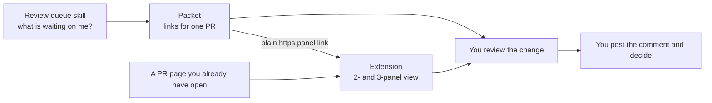

# How the extension and the skill fit together

The two tools answer different questions about the same thing. They share one idea: a docs PR is a pull request that changes Markdown, and every changed page has three URLs worth looking at, the multidev preview, the live page, and the GitHub diff.

## What each tool starts from

| Tool | Starts from | Finds |
|---|---|---|
| Review queue skill | Your GitHub account | The PRs that request your review, what looks stuck, and the links for one PR |
| Extension | A PR page open in your browser | The changed pages and the one-click preview, live, and side-by-side views |

The skill works from your terminal and finds the PRs for you. The extension works from a PR page you already have open.

## Why a link connects them

The skill prints plain `https` links to a PR's Files changed page with a marker on the end, for example `?pantheon_panel=2&page=<file>`. The extension recognizes that marker. With the extension installed, the tab becomes the 2-panel or 3-panel review view. Without it, the same link opens Files changed.

That design has three consequences:

- Neither tool needs the other. Each is useful alone.
- The link carries no extension ID, so it works for every install and opens from chat apps and Slack.
- Reviewers without the extension still land somewhere useful.

The skill also adds `?pantheon_review=1` to the Multidev and Live links it prints. The extension uses it to hide the docs site's cookie banner on pages reached through a link it or the skill supplied. The docs site ignores the parameter, so the links work without the extension.

## Why two copies of `pr-resolver.js`

Both tools resolve a changed file to its preview and live URL with the same logic. The skill ships its own copy of the extension's `pr-resolver.js`, so each tool works alone. Copies drift, so `tools/README.md` gives a `diff` command to run when you change either one.

## What they have in common

Both tools only read. Neither one approves, merges, or posts for you. See [Read-only by design](read-only-by-design.md).
