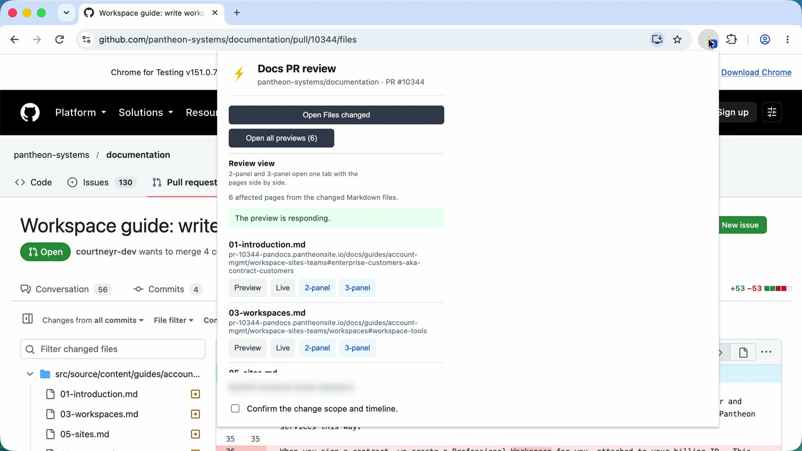
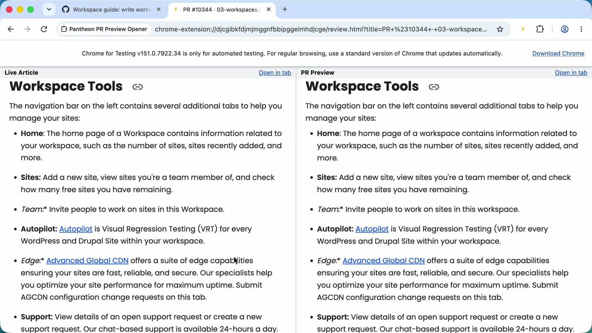
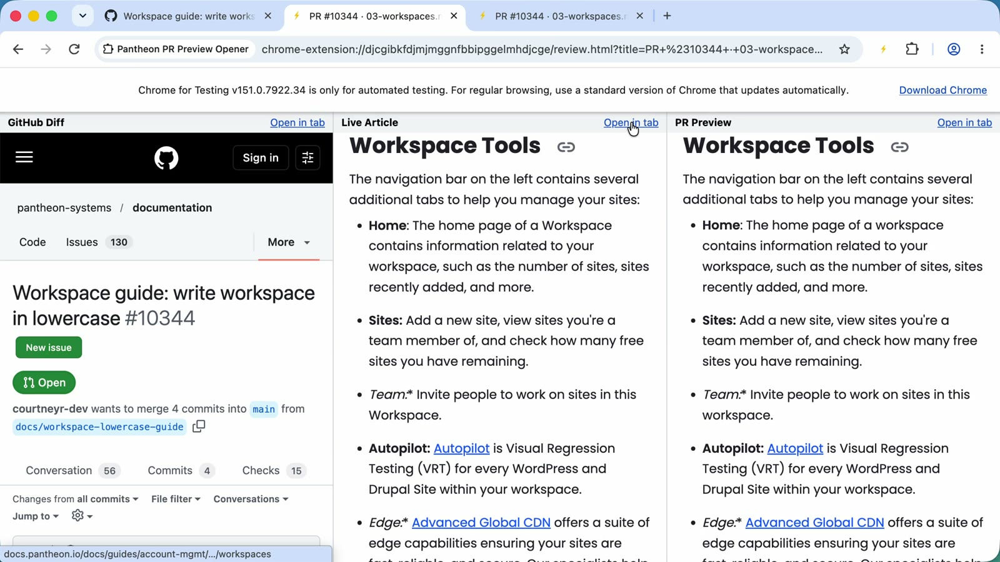
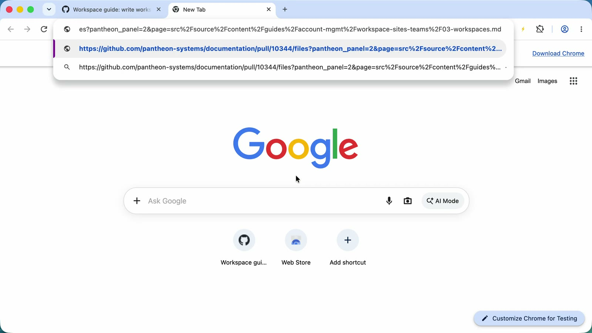
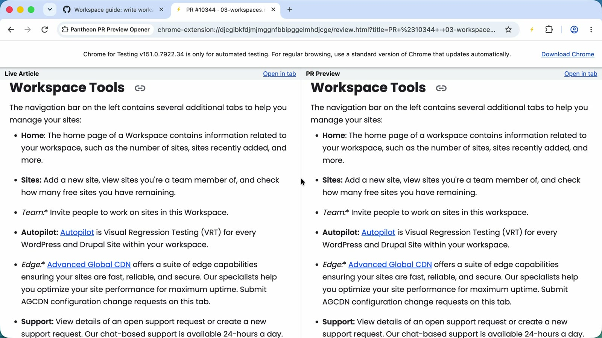

# Review a docs PR in side-by-side panels

Compare a changed page's live version with its PR preview, with the GitHub diff beside them when you want it. You also see how to share that view as a link. This assumes the [extension is installed](install-extension.md).

Watch it first: [Review a PR in 2- and 3-panel view](../media/videos/02-review-in-panels.mp4) (47 seconds, captions embedded; [transcript](../media/videos/02-review-in-panels.vtt)). To see how to share the view, watch [Share a panel link](../media/videos/03-share-a-panel-link.mp4) (32 seconds; [transcript](../media/videos/03-share-a-panel-link.vtt)).

## Open the review view

1. Open the PR on GitHub: `https://github.com/pantheon-systems/documentation/pull/<number>`. If it changes exactly one page, the preview already opened in a background tab and GitHub kept focus.
2. Click the lightning bolt. The popup lists one row per changed Markdown file that has a `permalink`.
3. On the row for the page you're reviewing, select **2-panel** or **3-panel**:
   - **2-panel** opens `Live Article | PR Preview`.
   - **3-panel** opens `GitHub Diff | Live Article | PR Preview`.
4. Scan the preview against the live page. Each pane has an **Open in tab** link if you want a full-size view.

Both panes open at the section that holds the first change, because the links end in that section's `#heading`. A new page or a front-matter-only change has no anchor, so it opens at the top.

The popup for a PR that changes six pages:



The 2-panel view. The left pane is the live page and the right pane is the PR preview. Here the PR changes "Workspace" to "workspace" in the list:



The 3-panel view adds the GitHub diff on the left:



## Work through the checklist

The popup keeps a review checklist for each PR and saves your progress. Select **Reset** to clear it. If the PR changes a `permalink`, a warning lists old and new values, and **Inspect middleware.ts** opens the file where the redirect would live. A release note adds a timestamp warning. See [Review release notes](review-release-notes.md).

## Open pages without the panel view

| Want | Select |
|---|---|
| One page's preview or live version in a background tab | **Preview** or **Live** on that row |
| Every changed page's preview | **Open all previews** (opens at most the first 15) |
| The PR's Files changed tab | **Open Files changed** |

## Share the view as a link

Send a reviewer straight to a page in panels with a plain link:

```text
https://github.com/pantheon-systems/documentation/pull/<number>/files?pantheon_panel=2&page=<path of the changed file>
```

- Use `pantheon_panel=3` for the 3-panel view.
- `page` is the full path of a changed Markdown file with a `permalink`, for example `src/source/content/nextjs/overview.md`, URL-encoded.
- With the extension installed, the tab becomes the review view. Without it, the link opens Files changed.
- The review queue skill prints these links for you. See [Review one PR](review-one-pr.md).

GitHub removes the marker from the address bar a moment after load. That's expected.

Paste the link into a new tab:



With the extension installed, the tab becomes the review view:



## When the preview doesn't load

A cold multidev can take about 30 seconds to answer the first request. Select **Retry preview**, or **View deployment checks** to open the PR's Checks tab. A merged or closed PR's multidev is deleted, so its preview returns 404. See [Troubleshoot](troubleshoot.md) for the full table.
