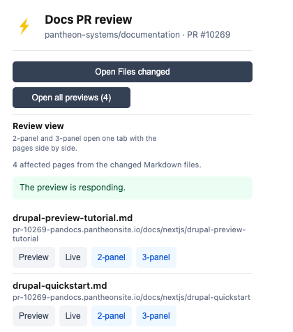
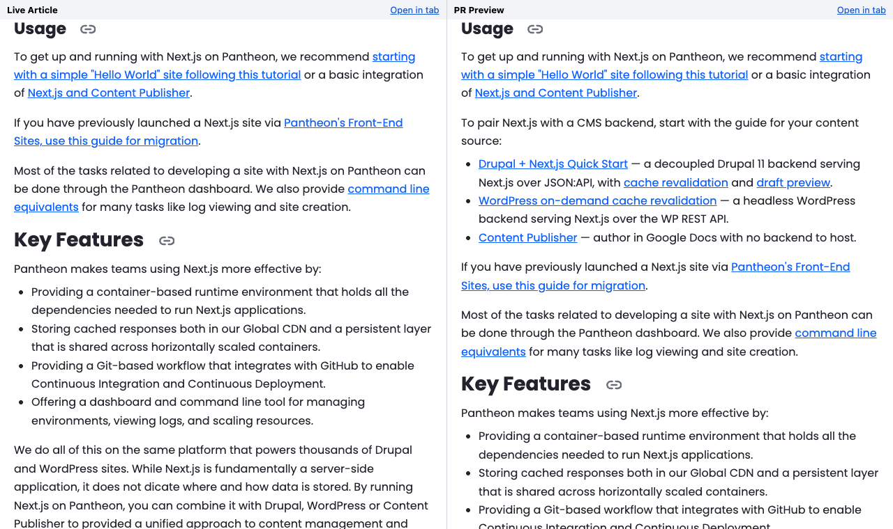

# Pantheon PR Preview Opener

A Chrome-family Manifest V3 extension for reviewing pull requests in `pantheon-systems/documentation`. It resolves each changed docs page to its multidev preview and its live equivalent, and it adds a per-PR review checklist. The toolbar icon is a standalone yellow lightning bolt.

It exists so you stop hand-assembling `pr-10269-pandocs.pantheonsite.io/docs/...` URLs from a diff. Open a docs PR, click the bolt, and every changed page is one click from its preview, its live page, and a side-by-side view of both.

## Quick start

This works in Chrome, Chromium, Brave, Edge, and other Chromium-based browsers. The extension isn't in the Chrome Web Store, and its manifest has no `update_url`, so your browser never updates it by itself. The folder on disk is what runs. Make that folder a git clone and GitHub stays your source of updates.

1. Clone just this folder. The sparse, shallow clone is about 2 MB, because the full repository is large:

   ```sh
   git clone --depth 1 --filter=blob:none --sparse https://github.com/pantheon-systems/documentation.git ~/pantheon-docs-tools
   git -C ~/pantheon-docs-tools sparse-checkout set tools/pantheon-pr-preview-extension
   ```

   Before PR #10307 merges, add `--branch add-pantheon-pr-preview-extension` to the first command.

2. Open `chrome://extensions` (`brave://extensions` in Brave, `edge://extensions` in Edge) and turn on **Developer mode**.
3. Select **Load unpacked** and choose `~/pantheon-docs-tools/tools/pantheon-pr-preview-extension`, the folder that contains `manifest.json`. In the macOS file picker, press **Cmd+Shift+G** and paste the path.
4. Pin the extension from the puzzle-piece menu so the bolt stays visible.
5. Open any documentation PR and click the bolt.

Already have a full clone of this repository? Skip step 1 and load `tools/pantheon-pr-preview-extension` from it.

### Update it

Pull, then reload the extension:

```sh
git -C ~/pantheon-docs-tools pull --ff-only
grep '"version"' ~/pantheon-docs-tools/tools/pantheon-pr-preview-extension/manifest.json
```

Then select the reload icon on the extension's card in `chrome://extensions`. The card's version should match the `grep` output.

- **Keep the folder where it is.** Chrome runs the extension from that path. If you move or delete the clone, the extension breaks until you load it again.
- **Don't edit files in it.** Local edits make `git pull --ff-only` fail. To change the extension, work in your own checkout of the repository and open a PR.
- **Don't load a downloaded ZIP.** A ZIP has no git history, so it never updates.



That's PR #10269, which changes four pages, so you get four rows. Each row is a changed Markdown file that has a front-matter `permalink`. **Preview** and **Live** open the two versions of the page in background tabs, and **2-panel** and **3-panel** open them side by side.



The 2-panel view of `overview.md` on the same PR. The three bullets under "Usage" exist only in the preview. Add the 3-panel view and the GitHub diff joins them on the left.

Open a PR that changes exactly one page and you don't even need to click: the preview opens in a background tab and GitHub keeps focus. To skip that, add `?pantheon_preview=off` to the PR URL.

## When it doesn't do what you expect

| What you see | Why, and what to do |
|---|---|
| No tab opened, badge shows a number | The PR changes two or more pages. By design, so use **Open all previews**. |
| No tab opened, no badge, and you've seen this PR before | The extension opens a PR's preview once per browser session. Use the **Preview** button, or restart the browser. |
| The preview tab is a 404 | The PR is merged (its multidev is deleted), or the build hasn't published yet. Wait, then **Retry preview**. |
| Badge shows `?` | The PR changes no Markdown page with a `permalink`, for example a PR that only touches `tools/`. Expected. |
| Badge shows `!`, or "GitHub metadata could not be loaded" | GitHub's unauthenticated API limit (60 requests an hour per IP). Wait up to an hour. |
| The panel says the preview isn't responding | A cold multidev can take about 30 seconds on the first request. **Retry preview**, or use **View deployment checks**. |
| A 2-panel or 3-panel link opens Files changed | The extension isn't loaded, or the link's `page=` isn't a changed file with a `permalink`. The badge shows `?` in that case. |
| The card shows a red **Errors** button | You selected the wrong folder. Reload with the one that holds `manifest.json`. |
| You changed code and nothing changed | Select the reload icon on the extension's card. |

Need to look inside? On `chrome://extensions`, select **service worker** on the card for the background console. Right-click the popup and choose **Inspect** for the popup's console.

## Requirements

- A Chromium-based browser that supports Manifest V3: Chrome 102 or later, Brave, or Edge. The extension uses a service worker and `chrome.storage.session`, which is why Chrome 102 is the floor (`minimum_chrome_version` in `manifest.json`).
- It has been tested in Chromium 151 (Chrome for Testing). Brave and Edge use the same extension APIs but haven't been tested.
- Scope: `pantheon-systems/documentation` only.

## How it recognizes a documentation PR

- A tab whose URL is `https://github.com/pantheon-systems/documentation/pull/<number>`, on any of the PR's sub-pages (Conversation, Commits, Checks, Files changed).
- A preview tab whose URL is `https://pr-<number>-pandocs.pantheonsite.io/...`. The panel shows the preview-tab view with **Retry preview**.
- Any other tab shows "Not on a documentation PR".

## Review panel

Click the toolbar icon on a documentation PR to open the panel.

- **Affected pages.** One row per changed Markdown file that has a front-matter `permalink`. Each row shows the full resolved preview URL, for example `pr-10303-pandocs.pantheonsite.io/docs/guides/global-cdn/global-cdn-faq#global-cdn-fastly-based`. The `#heading` anchor points at the section that holds the first change in the page body (see "Where the links jump").
- **Preview and Live buttons.** Each row opens the multidev preview (`pr-<number>-pandocs.pantheonsite.io`) or the same route on `docs.pantheon.io` in a background tab next to the PR tab. This is the preview/live comparison. If that page is already open, the button switches to it instead of opening a copy.
- **Open all previews.** Opens one background tab per affected page, in list order, directly after the PR tab. Pages already open are skipped, and large PRs open the first 15. The button shows the page count.
- **Open Files changed.** Opens the PR's Files changed tab next to the current tab.
- **Review view.** Each affected-page row has **2-panel** and **3-panel** actions. They open one extension tab (`review.html`) next to the PR tab, with the pages side by side as iframes in the order `Live Article | PR Preview` or `GitHub Diff | Live Article | PR Preview`. Each pane has an **Open in tab** link. GitHub ignores the `path` query as a filter, so the diff pane lists every changed file. An extension can't invoke Arc's native Split View, and Arc closes the popup as soon as it opens a tab, so the view is a single `tabs.create` call.
- **Files without a permalink.** Changed Markdown files with no `permalink` (release notes, for example) are listed in a note below the page list.
- **Per-PR checklist.** The review steps are saved separately for each PR in `chrome.storage.local`. **Reset** clears the current PR's checklist.

## Where the links jump

Preview and Live links end in the `#heading` of the section that holds the first change in the page body, so both panes open at the same place.

- Edits to the front matter (`title`, `permalink`, and so on) don't count. The first change after the front matter does.
- A change that only deletes lines points at the section the lines were removed from. An added blank line counts as a change.
- A renamed heading points at itself, and a repeated heading gets `-1`, `-2` (the site's own ids). Lines that start with `#` inside a code fence aren't headings.
- A brand-new page, a front-matter-only change, or a change above the first heading has no anchor, so the page opens at the top.
- On a sample of 20 changed pages from recent PRs, every anchor the extension produced exists on the live or preview page.

## Cookie banner

The docs site's cookie banner (OneTrust) is hidden only on pages the extension or the review skill supplied:

- Inside the 2-panel and 3-panel review view.
- On a docs or multidev link ending in `?pantheon_review=1`. The extension adds this to every docs and preview tab it opens (the popup's Preview and Live buttons, Open all previews, and the automatic preview tab), and the review skill adds it to the Multidev and Live links it prints. The site ignores the parameter, so the same link works without the extension.

A normal visit to the docs site, or a multidev you open yourself, keeps its banner. Hiding the banner doesn't click Accept and sets no consent cookie.

One thing to know: the docs site's cookie script treats any scroll as acceptance, with or without this extension (it records the consent cookie the first time you scroll). Hiding the banner removes the notice but doesn't change that, so scrolling in a review pane or on a marked link records consent the same way it does on a normal visit.

On those same pages the extension also re-scrolls to the anchored section for the first few seconds after load, because content above it can load late and leave it below the top. It stops as soon as you scroll or click. Those re-scrolls are hidden from the page's scroll tracking, so they never record consent on their own.

## Shareable panel links

A link to a PR's Files changed page can carry a marker that opens the 2-panel or 3-panel review view for one changed page:

```text
https://github.com/pantheon-systems/documentation/pull/<number>/files?pantheon_panel=<2|3>&page=<path of the changed file>
```

- With the extension installed, the tab becomes the review view for that page. `pantheon_panel=2` shows `Live Article | PR Preview`, and `3` adds the GitHub diff.
- Without the extension, the same link opens the PR's Files changed page.
- The link is a plain `https` URL with no extension ID, so it works for every install and opens from chat apps and Slack.
- `page` must be the full path of a Markdown file the PR changes (for example `src/source/content/nextjs/overview.md`) and that file needs a `permalink`. If the PR doesn't change it, the tab stays on GitHub and the toolbar badge shows `?`. Any other `pantheon_panel` value is ignored.
- GitHub removes the marker from the address bar a moment after the page loads. That is expected.
- A panel link doesn't also open the automatic preview tab.

## Warnings

- **Permalink changed.** The extension compares each changed file's `permalink` with the base branch (renamed files are matched by their previous name; new files are not flagged). Any change is listed as old → new, with a reminder to check the redirects in `src/middleware.ts` and any cross-links to the old path. **Inspect middleware.ts** opens that file on the PR branch, and a matching checklist item appears.
- **Release note: check the RSS timestamp.** Files under `src/source/releasenotes/` show their `published_at` (or `published_date`). That value feeds the RSS publication time. A date in the past may not publish as a new RSS item, and Slack won't treat the entry as new, so a quick fixup PR may be needed. Dates more than a day old are highlighted in red, and a matching checklist item appears.

## Slow or idle multidevs

- The panel checks whether the first affected page's preview answers. It reports a timeout, a 404, or a 5xx in plain language, and says when the multidev may be waking up or still deploying.
- **Retry preview** checks again. On a preview tab it also reloads the page.
- **View deployment checks** appears when the preview isn't responding. It opens the PR's Checks tab, where the deployment job and its logs live. GitHub exposes no Pantheon environment or build URL for a PR, so the Checks tab is the closest build page the extension can resolve.

## Automatic preview tab

When you open a PR whose changed Markdown resolves to exactly one page, the extension opens that preview in a background tab next to the PR tab. The GitHub tab keeps focus.

- It opens at most once per PR per browser session. The state is kept per PR in `chrome.storage.session`, so revisiting the PR, switching between its Conversation and Files tabs, or opening it in a second tab doesn't create another preview. A preview that's already open is never opened twice.
- If the PR touches several pages, nothing opens automatically. The toolbar badge shows the page count, and you choose from the panel.
- Badge `?` means no changed page with a permalink was found. Badge `!` means GitHub could not be read.
- GitHub is re-read at most once every 5 minutes per PR.
- To skip the automatic tab, add `?pantheon_preview=off` to the PR URL.

## Permissions

| Permission | Why |
|---|---|
| `webNavigation` | Detects navigation to a documentation PR for the automatic preview tab. |
| `tabs` | Finds already-open preview tabs to avoid duplicates, and opens, focuses, and reloads tabs. |
| `storage` | Saves checklist progress (`local`), and per-PR automatic-open state (`session`). |
| `declarativeNetRequest` | One dynamic rule removes `X-Frame-Options` and `Content-Security-Policy` from iframe requests to `github.com`, `docs.pantheon.io`, and `pantheonsite.io` that the extension's own review page makes, so GitHub can load inside the review view. It doesn't touch other pages or tabs. |

Host access:

- `github.com/pantheon-systems/documentation/*` and `api.github.com/repos/pantheon-systems/documentation/*`: read the PR, its changed files, and its patches.
- `raw.githubusercontent.com/*/*`: read changed Markdown front matter from the PR head (which can be a fork) and the base branch.
- `*.pantheonsite.io/*`: check whether the multidev responds and read the preview tab's URL.
- `docs.pantheon.io/*`: open and read the live pages.

One content script, `hide-cookie-banner.js`, runs on `docs.pantheon.io` and `*.pantheonsite.io` pages, including frames. It does nothing unless the page is inside the review view or the URL carries `pantheon_review=1` (see "Cookie banner").

The extension only opens or probes `github.com`, `docs.pantheon.io`, and `pr-<number>-pandocs.pantheonsite.io` URLs.

## Credentials and privacy

The extension has no credentials, sign-in, or tokens. Every request is an unauthenticated read, so GitHub's unauthenticated API rate limit applies (60 requests per hour per IP). It sends no data anywhere beyond those reads.

## Validation

From the repository root:

```sh
node --check tools/pantheon-pr-preview-extension/popup.js
node --check tools/pantheon-pr-preview-extension/service-worker.js
python3 -m json.tool tools/pantheon-pr-preview-extension/manifest.json
node tools/pantheon-pr-preview-extension/validate-resolver.cjs
```

`validate-resolver.cjs` runs offline against a mocked GitHub. It checks URL construction, the host allowlist, front-matter parsing, and the permalink-change and release-note detection.

## Current limitations

- The repository and preview hostname are hard-coded for Pantheon documentation.
- Only files with a front-matter `permalink` get preview and live links.
- The heading anchor is a generated Markdown slug; pages with custom anchor behavior may need a site-specific rule. Only the first changed section is linked, even when a PR changes several.
- `docs.pantheon.io` may redirect a live URL, so a live page that is already open can be opened a second time.

## Related

- [`tools/README.md`](../README.md): the index of everything in `tools/`.
- [`docs-devrel-review-queue`](../docs-devrel-review-queue/README.md): a Claude Code skill that lists the PRs waiting on you and prints these same preview, live, and panel links for any PR. Its 2-panel and 3-panel links open the review view here.
